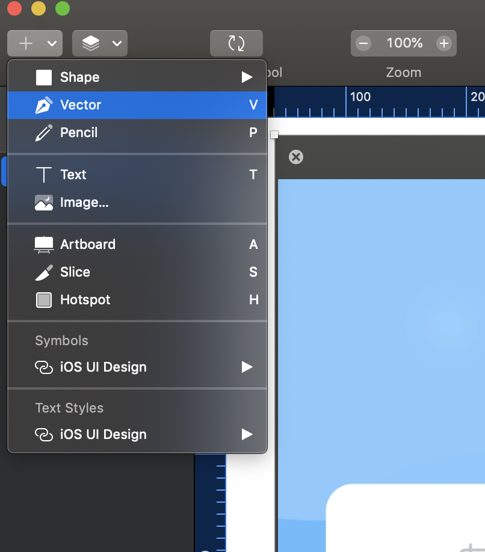
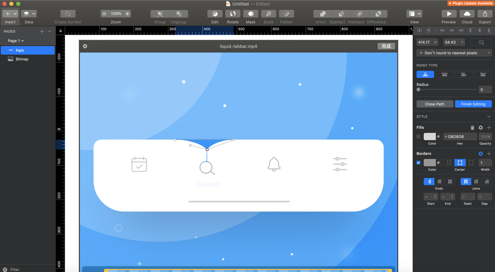
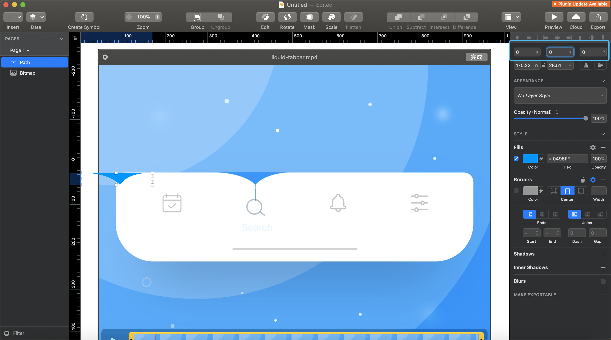
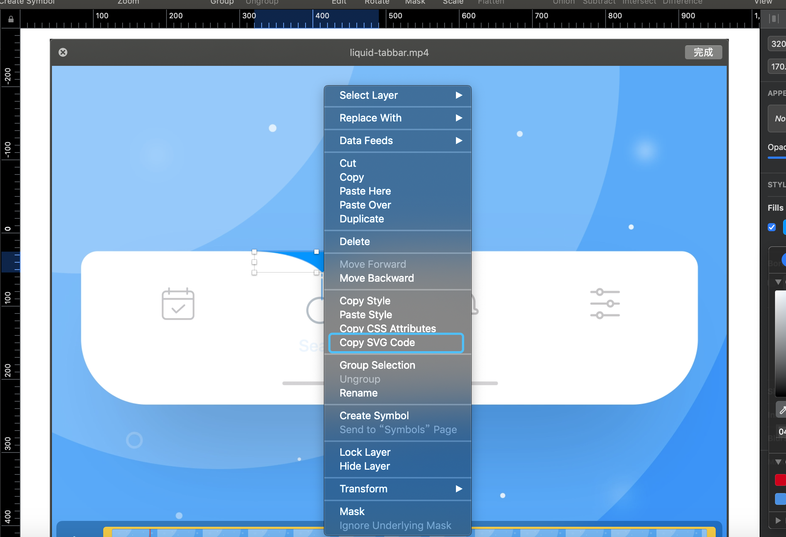

# sketch导出svg源码

## 1.选择矢量（钢笔）工具

点击sketch左上角加号选择矢量工具，或者快捷键“v”。然后就可以在画板上画不规则图形。



## 2.画出不规则图形

选择矢量工具后，就可以开始在画图形，再配合右边栏的工具画出你想要的图形。



## 3.清除位移

因为sketch导出的svg位置是以画板左上角为起始点，所以画完之后，要将图形的x，y位置清零。



## 4.导出svg源码



画完后，清空位移后，右键-->Copy SVG Code，就可以复制出svg源码。

```html
<svg width="170px" height="29px" viewBox="0 0 170 29" version="1.1" xmlns="http://www.w3.org/2000/svg" xmlns:xlink="http://www.w3.org/1999/xlink">
    <g id="Page-1" stroke="none" stroke-width="1" fill="none" fill-rule="evenodd">
        <path d="M0,0 L170.222656,0 C132.217448,0 106.721354,9.50260417 93.734375,28.5078125 C74.9557292,9.50260417 43.7109375,0 0,0 Z" id="Path" fill="#0495FF" fill-rule="nonzero"></path>
    </g>
</svg>
```