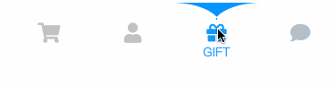

# 好看的交互动画的实现

这里是我收集的一些好看的web交互动画的分享。里面会介绍到如何实现这些效果。

注意：
  1. 这些效果非本人设计，我只是分享实现思路
  2. 暂时使用react实现
  3. 各个范例中图标是font-awesome

## 1.水滴效果tabbar

[详细分享](./src/components/liquid-tabbar/README.md)

[设计出处 https://uimovement.com/ui/7277/liquid-tabbar/](https://uimovement.com/ui/7277/liquid-tabbar/)

## 开关效果chatbar

## 滚珠效果tabbar