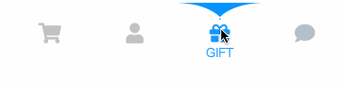
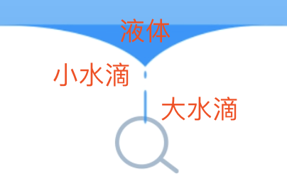
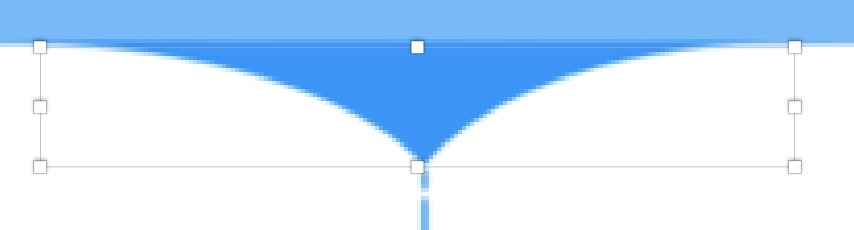
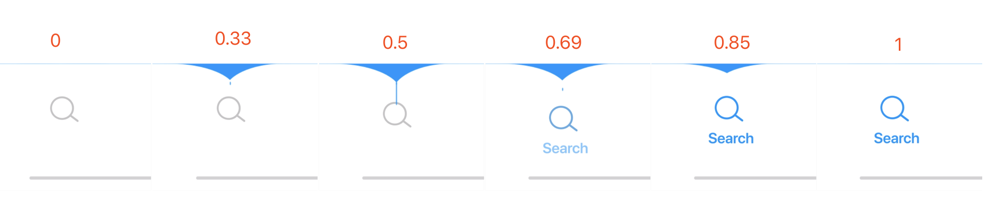

# 水滴效果tabbar



[设计出处 https://uimovement.com/ui/7277/liquid-tabbar/](https://uimovement.com/ui/7277/liquid-tabbar/)

## 分解动画

点开设计出处的链接，可以保存这个动画的视频（右键--> 视频另存为）。然后我们可以把视频逐帧逐帧拆解。

分解后我们可以看到整个动画主要分为连个部分：
* 不规则水滴图形的动画
* icon的抖动

### **svg图形和动画**

我们先建一个组件来做svg的动画

```javascript
import React, { Component } from 'react';
import './index.scss'


class LiquidSVG extends Component {
  render () {
    return (
      <svg width="260px" height="89px" viewBox="0 0 260 89" version="1.1" xmlns="http://www.w3.org/2000/svg">
      </svg>
    )
  }
}

export default LiquidSVG
```

然后可以用sketch画出不规则图形，并导出svg源码。

[sketch导出svg](../../../EXPORT-SVG.md)

**注意：导出的数据因为画板大小不一，矢量点位置不一，导出数据会和本文的数据不一样**

整个水滴动画其实有三个元素，上面较大一块的液体，中间一点小的水滴，下面一滴大的水滴。



#### 液体的动画

通过逐帧逐帧分解，其实大水滴就是两个状态间切换。

1. 展开状态



2. 闭合状态（合成一条线）


在sketch导出的源码中，我们只需要取出path元素作动画素材。

```html
<!-- 展开状体 -->
<svg width="260px" height="89px" viewBox="0 0 260 89" version="1.1" xmlns="http://www.w3.org/2000/svg" xmlns:xlink="http://www.w3.org/1999/xlink">
  <g id="Page-1" stroke="none" stroke-width="1" fill="none" fill-rule="evenodd">
    <path d="M0,0 C38.4112984,0 69.4112984,9.33333333 93,28 C113.463647,9.33333333 144.463647,0 186,0 L0,0 Z" id="Path" fill="#0495FF" fill-rule="nonzero"></path>
  </g>
</svg>

<!-- 闭合状态 -->
<svg width="260px" height="89px" viewBox="0 0 260 89" version="1.1" xmlns="http://www.w3.org/2000/svg" xmlns:xlink="http://www.w3.org/1999/xlink">
  <g id="Page-1" stroke="none" stroke-width="1" fill="none" fill-rule="evenodd">
    <path d="M129.99653,0.5 C157.332177,0.5 200.666667,0.5 260,0.5 L0,0.5 C59.3333333,0.5 102.66551,0.5 129.99653,0.5 Z" id="Path" fill="#0495FF" fill-rule="nonzero"></path>
  </g>
</svg>
```

再配合svg的animate属性，可以作出液体开合的动画：

```javascript
import React, { Component } from 'react';
import './index.scss'


class LiquidSVG extends Component {
  render () {
    return (
      <svg width="260px" height="89px" viewBox="0 0 260 89" version="1.1" xmlns="http://www.w3.org/2000/svg">
      <path id="liquid" fill="#0495FF" fillRule="nonzero">
        <animate
          attributeName="d"
          values="
            M129.99653,0.5 C157.332177,0.5 200.666667,0.5 260,0.5 L0,0.5 C59.3333333,0.5 102.66551,0.5 129.99653,0.5 Z;
            M129.99653,44 C156.66551,18 200,3.33333333 260,0 L0,0 C60,3.33333333 103.332177,18 129.99653,44 Z;
            M129.99653,0.5 C157.332177,0.5 200.666667,0.5 260,0.5 L0,0.5 C59.3333333,0.5 102.66551,0.5 129.99653,0.5 Z
          "
          keyTimes="0; 0.36; 1"
          dur="1s"
        />
        </path>
      </svg>
    )
  }
}

export default LiquidSVG
```

\<animate>标签中，“attributeName”是指需要执行动画的属性；keyTimes是指关键帧时机；values是指关键帧的时候属性的值；dur指动画时长；repeatCount指动画次数（默认一次）。

svg中\<animate>属性与css的animation的对应关系：

```css
  .animate{
    animation-name: animate;
    animation-duration: 1s;  /* dur值 */
    animation-iteration-count: 1; /* repeatCount值 */
  }

  @keyframes animate {  
    0% { /* keyTimes="0; 0.5; 1" 中的0，以下同理  */
      /* attributeName="opacity" */
      opacity: 1 /* values=“1; 0; 1”中的1，以下同理 */
    }
    50% {
      opacity: 0
    }
    100%{
      opacity: 1
    }
  }
```

走到这一步，你可以看到：


#### 小水滴动画

小水滴动画相对比较简单，就是一个点位移动画。

分解一下关键帧（这里图可能比较小，从视频那里看会更清晰。）



* 0: 动画开始
* 0.33 小水滴出现
* 0.5 开始下移
* 0.69 下移结束，并开始缩小
* 0.85 缩小至0，并消失
* 1 动画结束
